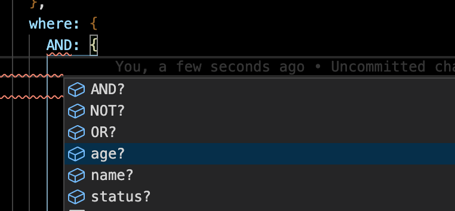
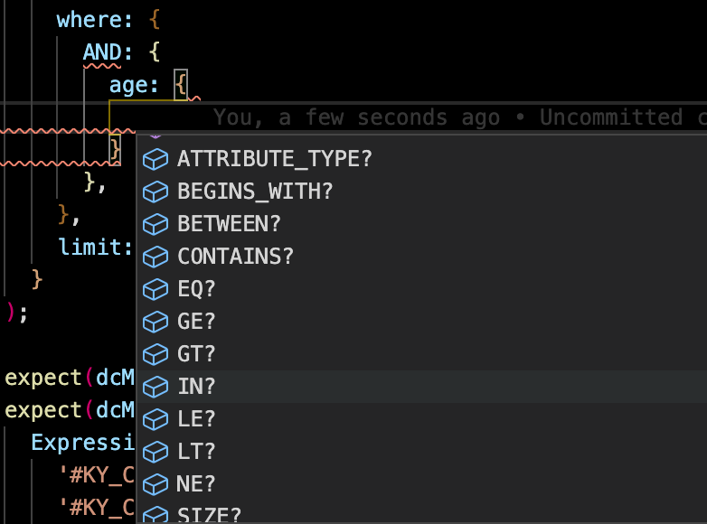

# How to recipes

This page will walk you through some of the unique recipes to enhance your development workflow when working with TypeDORM.

- [How to recipes](#how-to-recipes)
  - [Define default values](#define-default-values)
    - [Static Default values](#static-default-values)
    - [Dynamic Default values](#dynamic-default-values)
  - [Condition based updates](#condition-based-updates)
    - [Specify condition when using entity manager](#specify-condition-when-using-entity-manager)
  - [Apply filter to query](#apply-filter-to-query)
    - [Apply filter to query when using entity manager](#apply-filter-to-query-when-using-entity-manager)
  - [Write items in batches](#write-items-in-batches)
    - [Write items](#write-items)
    - [Retry unprocessed write items in batches](#retry-unprocessed-write-items-in-batches)
  - [Read items in batches](#read-items-in-batches)
    - [Read items](#read-items)
    - [Retry unprocessed read items in batches](#retry-unprocessed-read-items-in-batches)

## Define default values

`@Attribute` supports specifying default values by providing default values to add to entity at the creation time.

### Static Default values

```Typescript
@Entity(
  //...entity spec
)
class User {

  @Attribute()
  id: string

  @Attribute()
  firstName: string

  @Attribute()
  lastName: string

  @Attribute(
    default: 'available'
  )
  status: string
}
```

### Dynamic Default values

```Typescript
@Entity(
  //...entity spec
)
class User {

  @Attribute()
  id: string

  @Attribute()
  firstName: string

  @Attribute()
  lastName: string

  @Attribute(
    default: 'available'
  )
  status: string

  @Attribute<User>(
    default: (user) => `${user.firstName} ${user.lastName}`
  )
  name: string
}

// now when creating user record using one of the entity/transaction manager name will be auto appended,

const user = new User();
user.firstName = 'Mark'
user.lastName = 'Zuk'

// here `user.name` will be `Mark Zuk` from above defined pattern
```

| **A word of advice**: There is also a `@AutoGeneratedAttribute` which comes with some most used strategies and should be used over implementing own specification.

## Condition based updates

### Specify condition when using entity manager

To Perform a conditional update, specify a condition in a `where` option. The given condition must evaluate to true in order for operation to succeed.

```Typescript
const updatedResponse = await entityManager.update(
  User,
  {
    id: '1'
  },
  {
    name: 'new name'
  },
  {
    where: {
      age: {
        BETWEEN: [2,5]
      }
    }
  }
)

// this will generate following condition expression with given values
// ConditionExpression: '#CE_age BETWEEN :CE_age_start AND :CE_age_end',
```

## Apply filter to query

### Apply filter to query when using entity manager

TypeDORM can help you with building fluent filter expressions and all with full type safety.

i.e when writing query using entity manager for entity 'User', it can intelligently provide you with all the supported filter options so
no more typos.

 

```Typescript
const users = await entityManager.find<User, UserPrimaryKey>(
    User,
    {
      id: 'aaaa',
    },
    {
      keyCondition: {
        BEGINS_WITH: 'USER#',
      },
      where: {
        AND: {
          age: {
            BETWEEN: [1, 5],
          },
          name: {
            EQ: 'Me',
          },
          status: 'ATTRIBUTE_EXISTS',
        },
      },
      limit: 10,
    }
  );


// this will generate following filter expression
// (#FE_age BETWEEN :FE_age_start AND :FE_age_end) AND (#FE_name = :FE_name) AND (attribute_exists(#FE_status))
```

## Write items in batches

Batch manager provides an easy to use interface for writing items in a batch.
TypeDORM's batch manager can process unlimited number of items when writing items to a dynamodb even while using document client's batch api. The way it does it is by separating all request items into multiple batches of 25 items and processes them somewhat parallel with given concurrency.

Let's look at an example of writing items over batch manager api

### Write items

```Typescript
import {WriteBatch, BatchManager} from '@typedorm/core'

const user = new User();
user.id = '1';
// ...other user props

// first we create a write batch instance with all the items that we would like to write in a batch
const batchToWrite = new WriteBach()
  .addCreateItem(user)
  .addDeleteItem<Organisation, OrgPrimaryKey>(Organisation, {id: 'org-1'})
  ....other items

const batchResponse = await getBatchManager().write(batchToWrite, {
  concurrency: 10, // max 10 requests are run in parallel
  ...other optional options
})

// response
// batchResponse.failedItems - items that failed to put
// batchResponse.unprocessedItems - items that failed to process even after all retries
```

### Retry unprocessed write items in batches

If item was not processed even after x retries, it is returned back to user as `unprocessedItems`, if this was because low write throughput and you need to retry, you can do this very easily like this:

```Typescript
import {WriteBatch, BatchManager} from '@typedorm/core'

// i.e suppose there were x items returned as unprocessed items from earlier batch write attempt

// first create a new batch from earlier unprocessed items,
const newBatchFromUnprocessedItems = new WriteBatch().add(batchResponse.unprocessedItems)

const retryBatchWriteResponse = await getBatchManager().write(newBatchFromUnprocessedItems)

// response
// run some application logic.
```

## Read items in batches

Similarly to Batch manager's `write` op, `read` op also supports getting unlimited items in batches.

Let' look at how batch manger's read op works:

### Read items

```Typescript
import {ReadBatch, BatchManager} from '@typedorm/core'

// first we create a read batch instance with all the keys that we would like to get items for
const batchItemsToRead = new WriteBach()
  .addGetItem<User, UserPrimaryKey>({
    item: User,
    primaryKey: {
      id: '1'
    }
  })
  .addGetItem<Org, OrgPrimaryKey>({
    item: Org,
    primaryKey: {
      id: 'org-1'
    }
  })
  ....other items

const batchResponse = await getBatchManager().read(batchItemsToRead, {
  concurrency: 3, // max 3 requests are run in parallel
  ...other optional options
})

// batchResponse.items - all items returned
// batchResponse.unprocessedItems - all unprocessed items (item and primaryKey)
// batchResponse.failedItems - items that failed to get
```

_Note: When reading items in batches, order of items returned is not guaranteed._

### Retry unprocessed read items in batches

Again similar to write items, read items can also be manually retried like this:

```Typescript
import {ReadBatch, BatchManager} from '@typedorm/core'

// i.e suppose there were x items returned as unprocessed items from earlier batch read attempt

// first create a new batch from earlier unprocessed items,
const newBatchFromUnprocessedItems = new Read().add(batchResponse.unprocessedItems)

const retryBatchWriteResponse = await getBatchManager().read(newBatchFromUnprocessedItems)

// response
// run some application logic.
```
